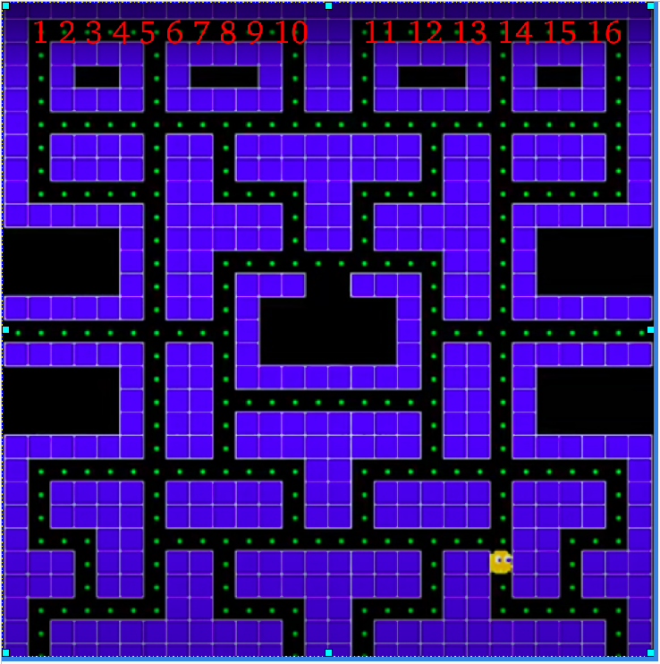
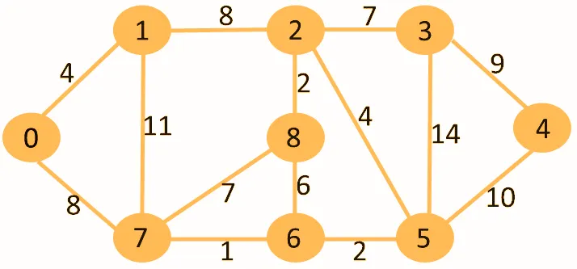

# Pacman-with-dijkstra-s-algorithm

Dijkstra's algorithm is a method for finding, in a directed or undirected graph with non-negative edge weights, the minimum-cost path from a source vertex to all other vertices in the graph.

How to works:

1. Initialization: Each vertex is assigned a “tentative distance”, which is initially infinite except for the origin vertex, whose distance is set to 0.

Iterative selection:
2. Repeatedly pick the unvisited vertex with the smallest tentative distance (using a priority queue).
Mark it as visited.

3. Edge relaxation:
For each outgoing edge from that vertex, see if going through it yields a shorter path to its neighbor.
If so, update the neighbor’s tentative distance (and record its predecessor if you want to reconstruct the path).

4. Repeat:
Go back to step 2 until all vertices are visited or all remaining unvisited vertices are unreachable.

For this program first we need to create a graph, then we need to create a pacman, then we need to create a pacman's movement, then we need to create a ghost's movement, and finally we need to create a game loop.
i need asocciate the graph with the then before loaded map i use the tiles as Vertex each tile is now a Vertex it is neccesary do to do for the load the weights and achieve find the pacman

At the images we can see list of number the witch it is our vertex the graph
where 1 it is the vertex 1 and 2 it is the vertex 2 ... all the weights is equals 1
As you can see an example:

And the ghost how to know where is pacman the ghost as pacman use a vertex how to geolocalization
then in time ejecution the ghost answes where is pacman? and pacman says i am in the vertex 3 and ghost see your vertex and meanwhile the ghost seek the vertex 3

The grahphs is an .jar file is a carpet dist.

